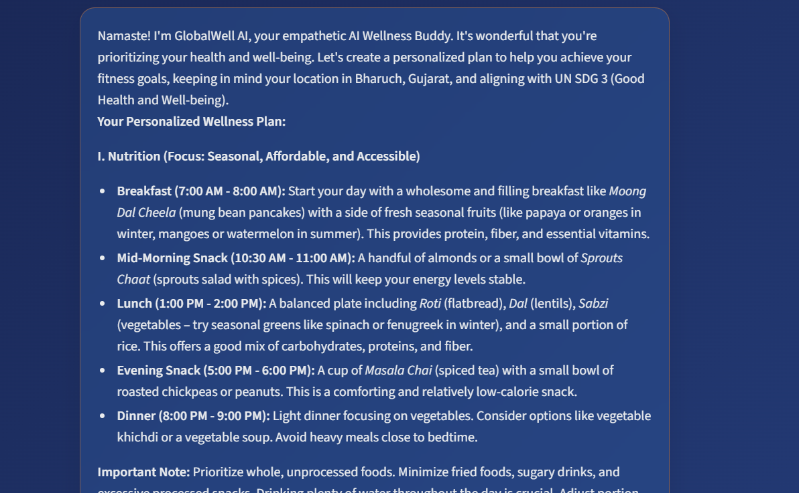
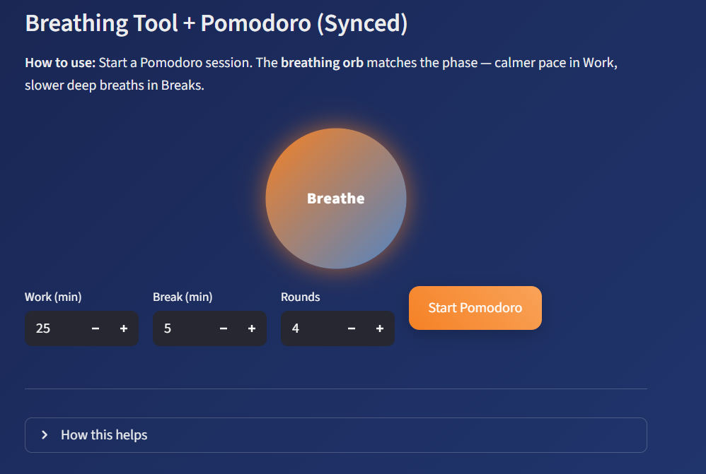
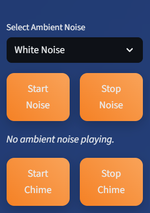
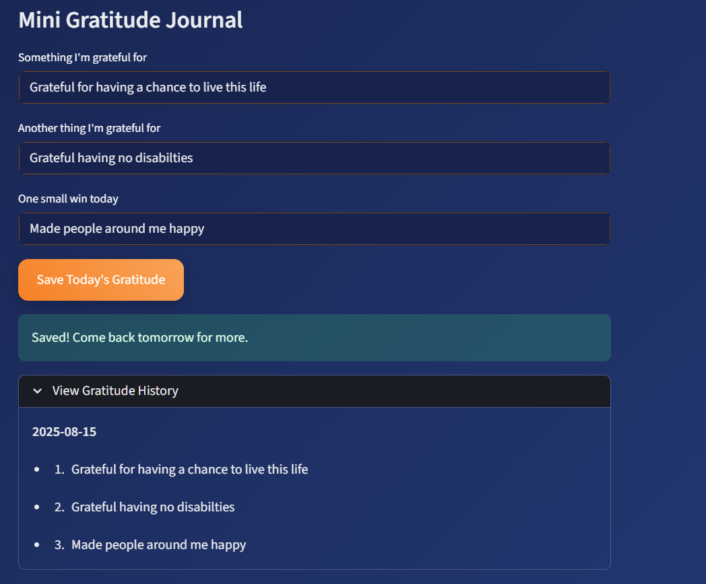

# GlobalWell AI

**GlobalWell AI** is a personal wellness companion powered by generative AI, designed to help users improve their health, habits, and overall well-being.
Aligned with **United Nations Sustainable Development Goal 3** — *Good Health and Well-being* — it delivers personalized, actionable guidance for a healthier life.

---

## Features

* **Personalized Wellness Plans** — Tailored nutrition, fitness, and mental health recommendations based on age, gender, location, activity level, and goals.
* **AI-Driven Local Insights** — Hyper-local seasonal produce suggestions, affordable nutrition tips, and myth-busting facts relevant to your region.
* **Ambient Noise Tools** — Soothing sounds (White Noise, Rain, Brown Noise) for focus and relaxation.
* **Productivity Aids** — Pomodoro timer and visual breathing orb to boost focus and reduce stress.
* **Gratitude Journal** — Log daily gratitude and small wins for improved mental health.
* **Health Literacy & Quizzes** — Fun facts, quick quizzes, and educational insights to stay motivated.
* **Mindfulness Chimes** — Regular prompts to take mindful breaks.
* **Dark Mode UI** — Clean, modern design optimized for low-light comfort.

---

## Installation

1. **Clone the repository**

   ```bash
   git clone https://github.com/yourusername/GlobalWell-AI.git
   cd GlobalWell-AI
   ```

2. **Install dependencies** (auto-installs on first run)

   * Streamlit
   * google-generativeai
   * python-dotenv
   * reportlab

3. **Configure environment variables**
   Create a `.env` file in the project root:

   ```env
   GEMINI_API_KEY=your_google_generative_ai_key_here
   ```

4. **Add ambient noise files**
   Place these `.mp3` files in the project root:

   ```
   white-noise-358382.mp3
   calming-rain-257596.mp3
   soft-brown-noise-299934.mp3
   ```

5. **Run the app**

   ```bash
   streamlit run app.py
   ```

---

## Feature Showcase

| Feature               | Preview                                                 | Description                                                                                       |
| --------------------- | ------------------------------------------------------- | ------------------------------------------------------------------------------------------------- |
| **Personalized Plan** |                  | AI-generated holistic wellness plans with sections for nutrition, fitness, and mental well-being. |
| **Wellness Tools**    |                | Includes breathing orb, local produce guide, and wellness myth-buster.                            |
| **Productivity Aids** |  | Ambient noise players and Pomodoro timer for focus.                                               |
| **Gratitude Journal** |            | Daily gratitude log to boost mental health.                                                       |

---

## File Structure

```
GlobalWell_AI/
├── .venv/
├── screenshots/
│   ├── plan_view.png
│   ├── tools_view.png
│   ├── productivity_view.png
│   └── journal_view.png
├── .gitignore
├── .env
├── app.py
├── requirements.txt
├── white-noise-358382.mp3
├── calming-rain-257596.mp3
└── soft-brown-noise-299934.mp3
```

---

## Contributing

We welcome contributions!
If you have suggestions or improvements, please open an **issue** or submit a **pull request**.

---

## License

This project is licensed under the **MIT License**.

---

## Credits

* **Ambient sound files** — [Pixabay Audio](https://pixabay.com/)
* **Generative AI** — Powered by [Google Gemini](https://ai.google/)
* Created by **Akshat Chhatriwala**
